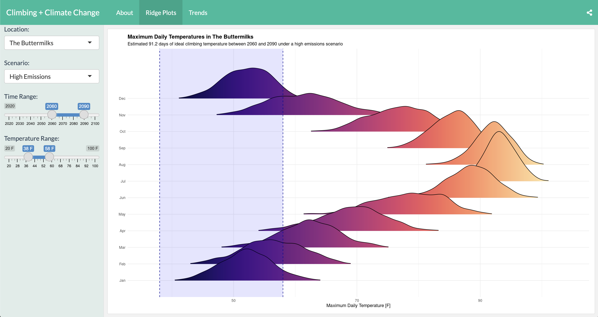

# Climbing and Climate Change

 

Showcasing the impacts of climate change on popular climbing locations in California and Nevada through an interactive dashboard. Currently focusing on impacts to daily maximum temperatures and ideal climbing weather. 

 

 <figure>
   Figure 1. Sample screenshot</figcaption>
</figure>
